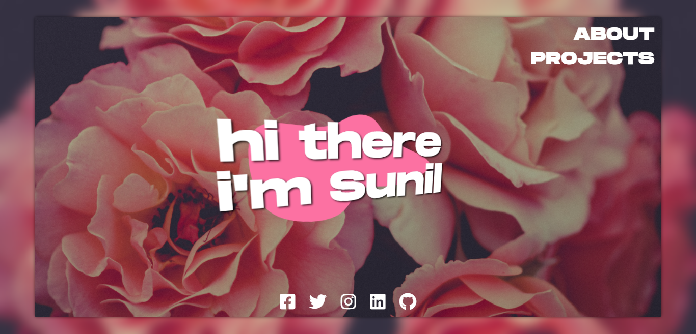
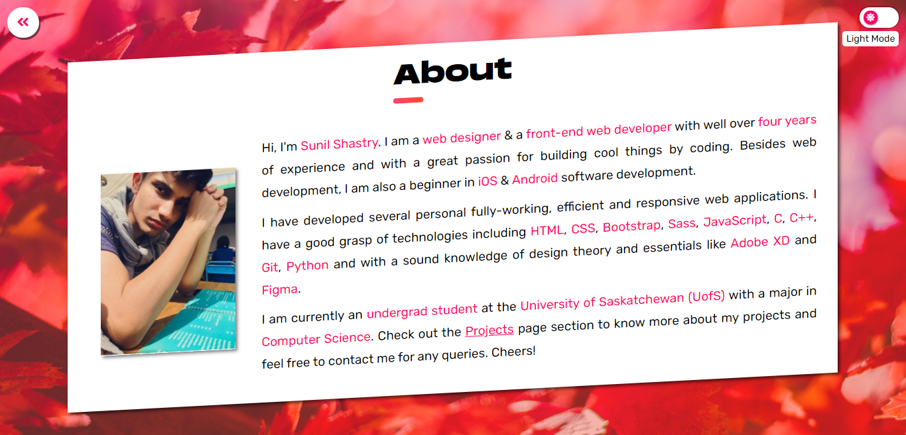
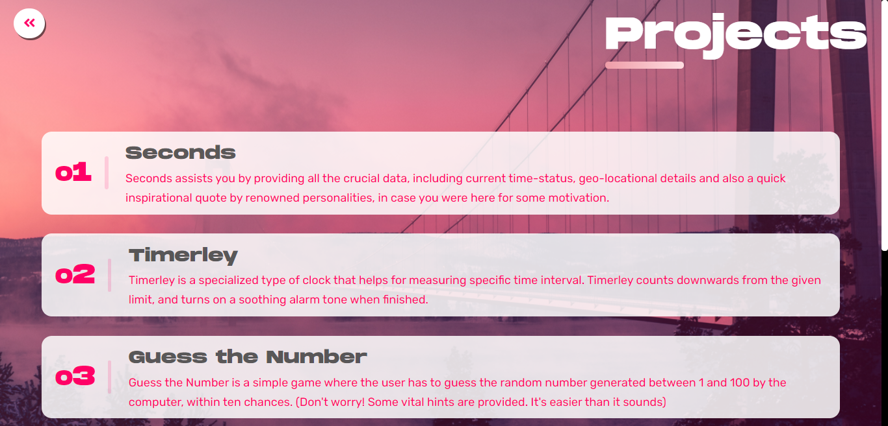

# Sunil Shastry

## [https://www.sunilshastry.com](https://www.sunilshastry.com)

## **Welcome!**

---

_Welcome to the public GitHub repository of my personal portfolio website. Get access to view my projects, basic details and educational background by visiting my portfolio._

---

## **About**

Hi! I'm Sunil. I am a 19 year old web designer and front-end web developer. I am currently a Computer-Science student studying at the University of Saskatchewan in Canada. I have always found it fascinating to learn something new in terms of computer science. I enjoy my coffee with some donuts! Visit my portfolio to know more or to contact me. Cheers!

## **Projects**

I have designed and developed several personal projects using modern programming languages. Please visit my portfolio to view all my projects in much detail. (Most projects have been done using front-end technologies like HTML, CSS & JavaScript)

## **Contact & Hire**

Please contact me by mailing to [haster.dev](hasterdeveloper@gmail.com) (hasterdeveloper@gmail.com) for any queries. I am a web designer and a front end web-developer proficient in technologies including HTML, CSS, Sass, Bootstrap, JavaScript, ReactJS, Git, Responsive Designs, Figma, Adobe XD, with over three years of experience. I am currently a computer science student at the University of Saskatchewan in Canada. Please contact me to hire.

---

## Want to know more about me?

_If you wish to know more about me and the projects I've developed and designed, or simply contact me for any queries:_

Contact me on

[LinkedIn](https://www.linkedin.com/in/sunilshastry/ "Sunil on LinkedIn")

[Twitter](https://twitter.com/sunillshastry "Sunil on Twitter")

[Instagram](https://www.instagram.com/sunillshastry/ "Sunil on Instagram")

[Facebook](https://www.facebook.com/sunilshastryy "Sunil on Facebook")
